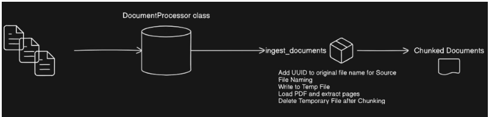
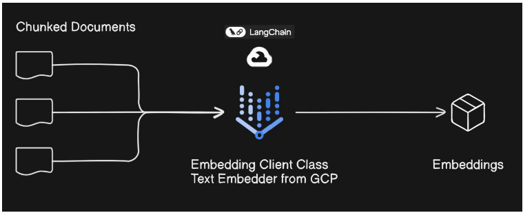
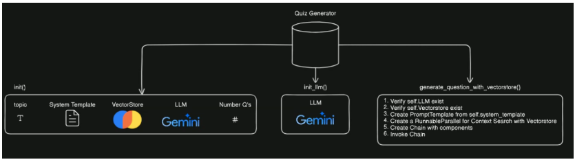
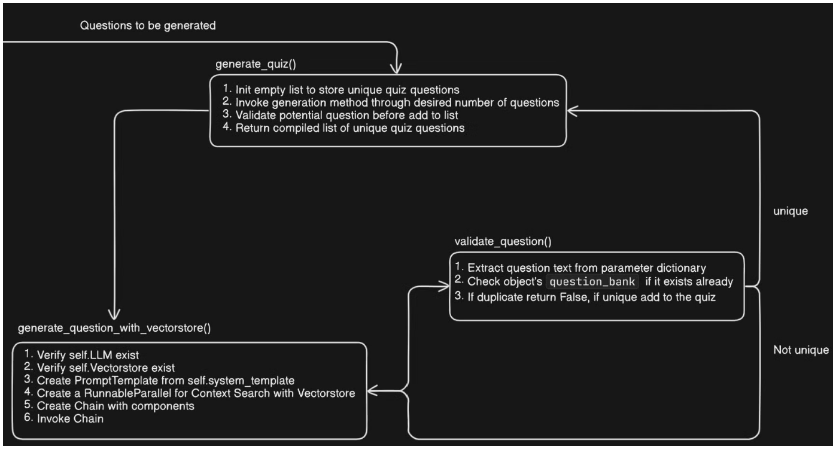
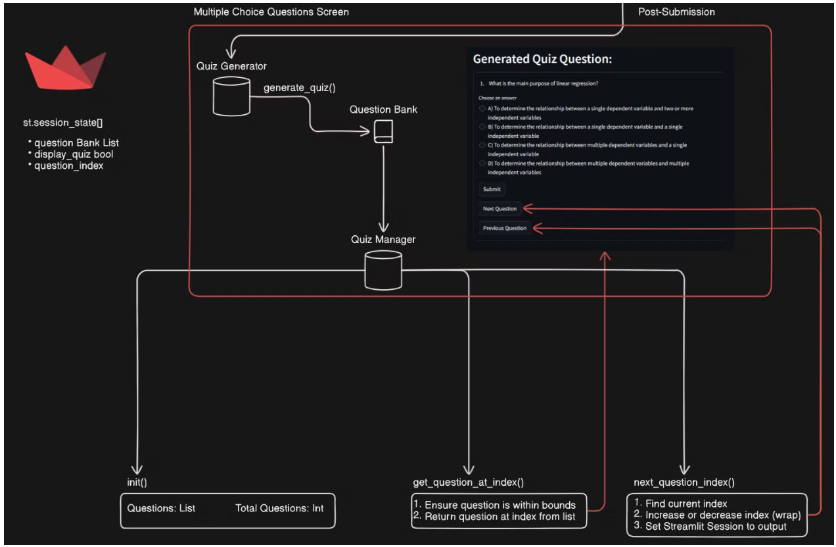

# Gemini Quizzify - A Dynamic AI Quiz Generator

## Overview
This project involves developing a Quiz Builder using a range of technologies, including Google Cloud Platform, Google Gemini, Vertex AI API, Vertex embeddings, Chromadb, Langchain, PDF loader, and Streamlit. It is part of the challenges set by Radical AI, with contributions focused on specific implementation steps.

This Quiz Builder dynamically generates quizzes based on user-provided documents, ranging from textbooks to scholarly papers. The tool offers a tailored learning experience with instant feedback and comprehensive explanations, facilitating deeper comprehension and retention of knowledge.

## Tech Stack
* **Google's Vertex AI Platform:** Enables advanced machine learning capabilities using pre-trained models for embedding and processing natural language data, allowing for seamless integration with other AI-driven components.
* **Chromadb:** A vector database that stores and retrieves embeddings, enabling efficient similarity searches and comparisons across large datasets.
* **Langchain:** A framework that simplifies the integration and chaining of multiple language models, enhancing the dynamic generation and processing of content in the application.
* **Python 3.10:** The programming language used for developing this application, providing the flexibility and power needed to handle complex data processing and machine learning tasks.
* **Streamlit:** A powerful framework for building and deploying interactive web applications in Python, facilitating the creation of a user-friendly interface for the Quiz Builder.

## Tasks:
1. **Google Cloud, Vertex AI, & SDK Authentication:** Create a GCP account (if you don't have one), set up a project, enable the Vertex AI APIs, and manage service accounts with owner permissions.
2. **Development Environment Setup:** Clone or fork the GitHub repository while managing its security. Set up GCP service account keys and resolve authentication errors.
3. **Document Ingestion:** Create a Python file that can upload, process PDFs using PyPDFLoader, and test document ingestion and file handling with Streamlit.
4. **Embedding with Vertex AI & Langchain:** Create the `__init__` method, initialize VertexAIEmbeddings, and test the setup by embedding "Hello World" in Streamlit.
5. **Data Pipeline to Chroma DB:** Dive into data transformation and collection with ChromaDB, including document processing, splitting text chunks using CharacterTextSplitter, creating an in-memory Chroma collection, and testing integration with a small PDF using Streamlit.
6. **Streamlit UI for Data Ingestion:** Empower quiz creation with AI integration by initializing DocumentProcessor, EmbeddingClient, and ChromaCollectionCreator. Use Streamlit to build a user-friendly form for selecting topics and specifying question quantities, and leverage the Chroma collection for generating quiz questions.
7. **Quiz Generator Class:** Enhance quiz question creativity with Gemini Pro by setting up the QuizGenerator to use the "gemini-pro" model, configuring parameters for controlled output, and integrating with the vector store for context-driven question generation.
8. **Generate Quiz Algorithm**: Generating a unique quiz with robust validation by looping through questions to ensure uniqueness with a retry limit, validating against the question bank, and streamlining testing with Streamlit.
9. **Generate Quiz UI:** Implement the QuizManager class to store and manage quiz questions, allowing seamless and effortless navigation between questions. Use Streamlit to display questions and test the application with PDF ingestion.
10. **Screen State Handling:** Streamline quiz setup and navigation by initializing the question bank, setting the topic and question quantity with Streamlit widgets, managing quiz generation and display, and testing the application for a seamless user experience.

## Installation

### Prerequisites
* Python 3.10
* streamlit
* chromadb
* langchain
* langchain_community
* langchain-google-vertexai
* pypdf
* streamlit

### Step-by-Step Installation Guide
1. **Clone the GitHub Repository:** Open your terminal and clone the project repository.
2. **Create and Activate a Virtual Environment:** Create a conda environment with `conda create --name quizzify python==3.10 -y` and activate it with `conda activate quizzify`.
3. **Install Requirements:** Install the required Python packages by running `pip install -r requirements.txt` in the project directory.

## Usage

1. **GCloud authentication**
```bash
* Create a new Google Cloud project.
* Enable the Vertex AI API for the project.
* Create a service account with necessary roles (e.g., Owner, AI Platform Admin, Vertex AI Administrator, Vertex AI Model Creator).
* Initialize Google Cloud in the terminal with `gcloud init`, follow the steps shown in the terminal, and run `gcloud auth application-default login` to log in to your Google Cloud account.
```
2. **Update the Scripts:** Modify the Python scripts as necessary with the Project ID and location.
3. **Run the Streamlit App**: Launch the Streamlit application (`your_script.py` - main script) and view it in your browser at `http://localhost:8501`.


## Project Structure

**Document Processing**
Document processing involves creating a class that manages the ingestion of PDF documents. The process includes uploading PDFs via a Streamlit widget, chunking the documents into manageable pieces, and storing them for further use. The document processor handles temporary files, processes them into chunks, and returns a set of documents with associated metadata for later use in the system.


**Embedding Client**
The embedding client converts extracted text from documents into embeddings using Vertex AI and LangChain. This lightweight class processes documents to generate vector representations, which are essential for integrating with ChromaDB and handling semantic data. The class facilitates efficient embedding of text and provides a foundation for subsequent data processing tasks.


**Quiz Generation**
The Quiz Generator class creates multiple-choice questions by leveraging a large language model and a vector store. It initializes with a system prompt and uses the model to generate questions based on specified topics, integrating contextual information from documents. The class employs LangChain for managing prompt templates and contextual searches, ensuring that questions are relevant and well-structured.


**Generate Quiz Algorithm**
The Generate Quiz Algorithm method constructs a quiz by generating a specified number of unique questions on a given topic. It uses a loop to create questions, verifies each one for uniqueness against an existing question bank, and handles potential duplicates by skipping them. The algorithm also incorporates a validation function to ensure the questions do not repeat, ensuring a diverse set of questions for the final quiz.


**Screen State Handling**
Screen State Handling manages the flow between different screens and forms in the Quizify application. It utilizes Streamlit’s session state to keep track of the current question index and the status of the quiz, allowing users to navigate between questions without losing their progress. By storing and updating the question index and other relevant data in the session state, the application ensures a smooth and consistent user experience across different interactions and screens.


**Output**


## Contribution
We welcome contributions to enhance the features and functionality of Gemini Explorer. 
Please follow these steps to contribute: 
* 1. Fork the repository. 
* 2. Create a new branch for your feature or bug fix. 
* 3. Commit your changes and push them to your branch. 
* 4. Open a pull request with a detailed description of your changes.

## Acknowledgments
This project is based on Mission-Quizify, developed by RadicalXDev. A big thank you to the entire team for providing the foundation for this project and the platform for honing our skills and expertise.

 - For providing the challenges and inspiration that drove this project.
 - For facilitating the development of the user interface.
 - For offering the APIs and services essential to this project.
 - For providing the framework and advanced text embeddings technology.
 - For providing the powerful vector storage and retrieval solutions.